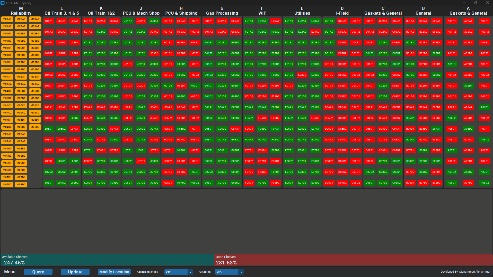
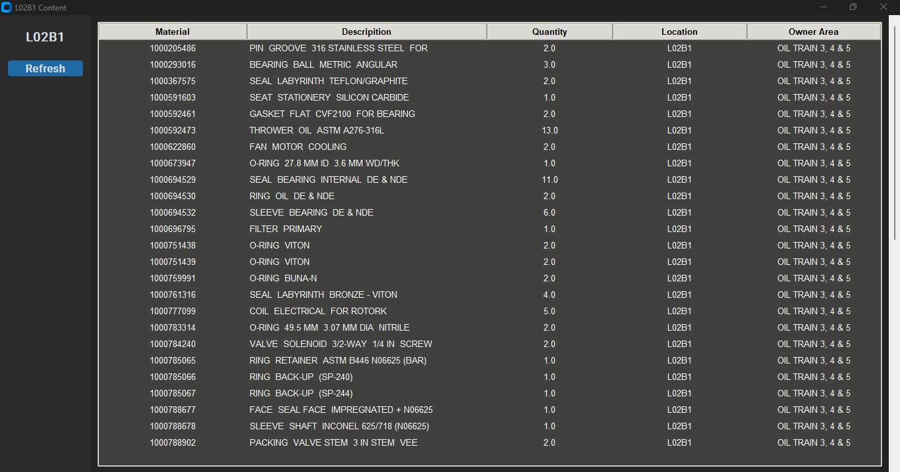

A lightweight custom GUI dashboard that actively monitors 526 physical shelf locations. It provides data such as availability, content display and a search function. Using it, the Material Center team can easily know what locations are available for staging the next time they receive a new material batch.

# Main Dashboard

# Content Window

